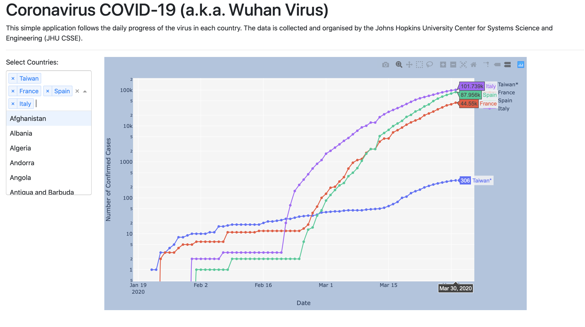

# Wuhan Virus Project

This project is a monitoring application of the Coronavirus (COVID-19) pandemic in the world.

 
 
The data is from the Johns Hopkins University Center for Systems Science and Engineering (JHU CSSE).