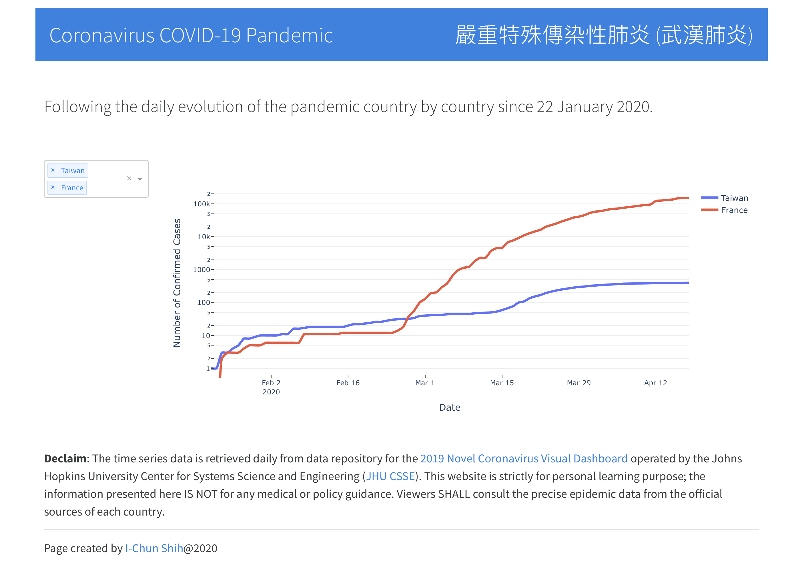

# Wuhan Virus Project

This personal project visualises the daily evolution of Coronavirus COVID-19 pandemic. 

 

## Links

Git repository: [wuhan-virus-pandemic](https://github.com/icshih/wuhan-virus-pandemic)

Web application: [https://covid-19-pandamic.herokuapp.com](https://covid-19-pandamic.herokuapp.com)

 
## Data Source
- Johns Hopkins University Center for Systems Science and Engineering [https://github.com/CSSEGISandData/COVID-19](https://github.com/CSSEGISandData/COVID-19).

## Dependencies
- Python 3
- Pandas
- Numpy
- Scipy
- Plotly
- Dash
 
 ---

[I-Chun SHIH](http://www.linkedin.com/in/icshih)@2020
