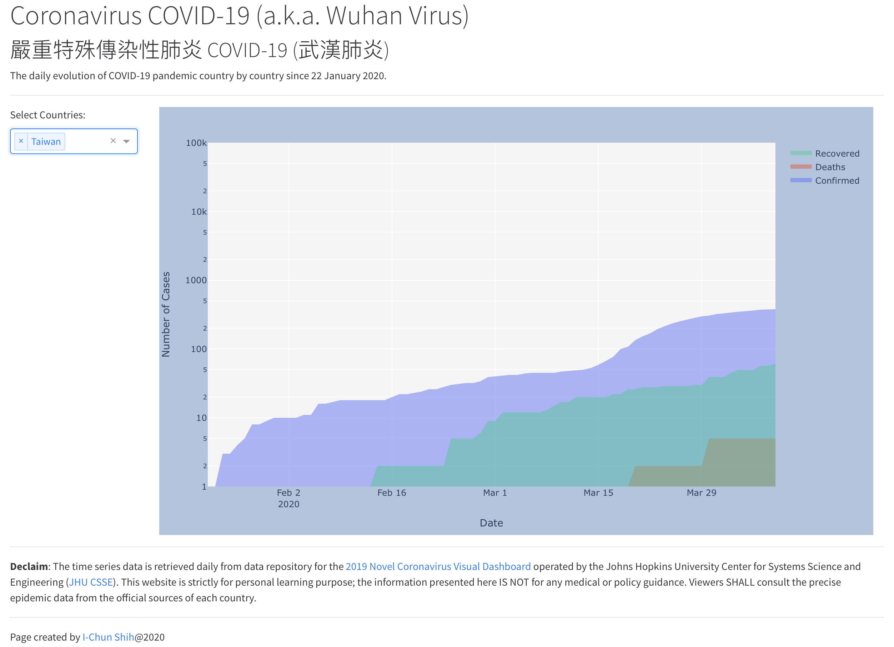

# Wuhan Virus Project

This personal project visualises the daily evolution of Coronavirus COVID-19 pandemic. 

 
 
## Data Source
- Johns Hopkins University Center for Systems Science and Engineering [https://github.com/CSSEGISandData/COVID-19](https://github.com/CSSEGISandData/COVID-19).

## Tech Stack
- Python 3
- Pandas
- Numpy
- Plotly
- Dash
 
 ---

[I-Chun SHIH](www.linkedin.com/in/icshih)@2020
